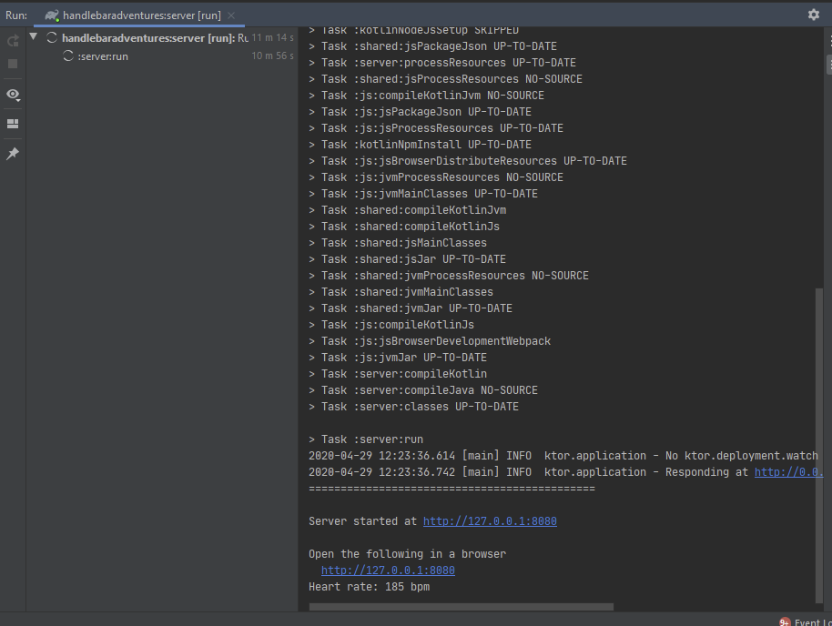

# jetbrains-repro
Repro repo for various issues with Jetbrains' products (IntelliJ, Kotlin, Ktor, ...)

# Environment Tested

- Windows 10 x64 1909
- AdoptOpenJDK JDK 14.0.1
- Gradle 6.4
- IntelliJ 2020.1.1 with Kotlin EAP plugin

# General Setup

- Import project in IntelliJ

# [IDEA-239654](https://youtrack.jetbrains.com/issue/IDEA-239654)

1. Go to the Gradle tool window and run `jetbrains-repro/server/Tasks/application/run`
2. Go to the Run tool window and click ■ to kill `jetbrains-repro:server [run]`
3. The button is now disabled, but the process is never killed and `java.exe` must be manually terminated in Task Manager



This does NOT happen when you debug `jetbrains-repro/server/Tasks/application/run` instead of running it, as in that case the kill completes normally.

# [IDEA-240612](https://youtrack.jetbrains.com/issue/IDEA-240612)

1. Go to the Gradle tool window and execute `jetbrains-repro/server/Tasks/application/run`
2. Run the `Android` run configuration
3. The Android application never launches as IntelliJ waits for `jetbrains-repro:server [run]` to finish.

This does NOT happen when inverting the order of steps 1 and 2 as the Android app Gradle rebuild can fully complete before the server is launched with Gradle.

# [KT-38651](https://youtrack.jetbrains.com/issue/KT-38651)

1. Navigate to `server/src/main/kotlin/main.kt`
2. Click the <span style="color: green">⯈</span> next to `fun main() {`
3. You will now see the following error in the Run tool window for `MainKt`:

```
Exception in thread "main" java.lang.NoClassDefFoundError: com/racepartyapp/shared/HeartRate
	at com.racepartyapp.server.MainKt.main(main.kt:63)
	at com.racepartyapp.server.MainKt.main(main.kt)
Caused by: java.lang.ClassNotFoundException: com.racepartyapp.shared.HeartRate
	at java.base/jdk.internal.loader.BuiltinClassLoader.loadClass(BuiltinClassLoader.java:602)
	at java.base/jdk.internal.loader.ClassLoaders$AppClassLoader.loadClass(ClassLoaders.java:178)
	at java.base/java.lang.ClassLoader.loadClass(ClassLoader.java:522)
	... 2 more
```

This does NOT happen when launching via Gradle.

# [KT-38868](https://youtrack.jetbrains.com/issue/KT-38868)

1. Turn on JS IR compiler by uncommenting `kotlin.js.compiler=ir` in `shared/gradle.properties`, `client/gradle.properties` and `js/gradle.properties` 
2. Go to the Gradle tool window and execute `jetbrains-repro/server/Tasks/application/run` 
3. You will now see the following error in the Run tool window for `jetbrains-repro:server [run]`:

```
> Task :shared:compileKotlinJs FAILED
e: java.lang.IllegalStateException: Serializable class must have single primary constructor
	at org.jetbrains.kotlinx.serialization.compiler.backend.ir.IrBuilderExtension$DefaultImpls.buildInitializersRemapping(GeneratorHelpers.kt:432)
	at org.jetbrains.kotlinx.serialization.compiler.backend.ir.SerializableIrGenerator.buildInitializersRemapping(SerializableIrGenerator.kt:35)
	at org.jetbrains.kotlinx.serialization.compiler.backend.ir.SerializableIrGenerator$generateInternalConstructor$1.invoke(SerializableIrGenerator.kt:43)
	at org.jetbrains.kotlinx.serialization.compiler.backend.ir.SerializableIrGenerator$generateInternalConstructor$1.invoke(SerializableIrGenerator.kt:35)
	at org.jetbrains.kotlinx.serialization.compiler.backend.ir.IrBuilderExtension$DefaultImpls.contributeConstructor(GeneratorHelpers.kt:117)
	at org.jetbrains.kotlinx.serialization.compiler.backend.ir.SerializableIrGenerator.contributeConstructor(SerializableIrGenerator.kt:35)
	at org.jetbrains.kotlinx.serialization.compiler.backend.ir.IrBuilderExtension$DefaultImpls.contributeConstructor$default(GeneratorHelpers.kt:101)
	at org.jetbrains.kotlinx.serialization.compiler.backend.ir.SerializableIrGenerator.generateInternalConstructor(SerializableIrGenerator.kt:42)
	at org.jetbrains.kotlinx.serialization.compiler.backend.common.SerializableCodegen.generateSyntheticInternalConstructor(SerializableCodegen.kt:41)
	at org.jetbrains.kotlinx.serialization.compiler.backend.common.SerializableCodegen.generate(SerializableCodegen.kt:33)
	at org.jetbrains.kotlinx.serialization.compiler.backend.ir.SerializableIrGenerator$Companion.generate(SerializableIrGenerator.kt:172)
	at org.jetbrains.kotlinx.serialization.compiler.extensions.SerializerClassLowering.lower(SerializationLoweringExtension.kt:47)
	at org.jetbrains.kotlinx.serialization.compiler.extensions.SerializationLoweringExtensionKt$runOnFileInOrder$1.visitClass(SerializationLoweringExtension.kt:34)
	at org.jetbrains.kotlin.ir.visitors.IrElementVisitorVoid$DefaultImpls.visitClass(IrElementVisitorVoid.kt:44)
	at org.jetbrains.kotlinx.serialization.compiler.extensions.SerializationLoweringExtensionKt$runOnFileInOrder$1.visitClass(SerializationLoweringExtension.kt:28)
	at org.jetbrains.kotlinx.serialization.compiler.extensions.SerializationLoweringExtensionKt$runOnFileInOrder$1.visitClass(SerializationLoweringExtension.kt:28)
	at org.jetbrains.kotlin.ir.declarations.impl.IrClassImpl.accept(IrClassImpl.kt:172)
	at org.jetbrains.kotlin.ir.declarations.impl.IrFileImpl.acceptChildren(IrFileImpl.kt:64)
	at org.jetbrains.kotlin.ir.visitors.IrElementVisitorVoidKt.acceptChildrenVoid(IrElementVisitorVoid.kt:271)
	at org.jetbrains.kotlinx.serialization.compiler.extensions.SerializationLoweringExtensionKt$runOnFileInOrder$1.visitElement(SerializationLoweringExtension.kt:30)
	at org.jetbrains.kotlin.ir.visitors.IrElementVisitorVoid$DefaultImpls.visitPackageFragment(IrElementVisitorVoid.kt:30)
	at org.jetbrains.kotlinx.serialization.compiler.extensions.SerializationLoweringExtensionKt$runOnFileInOrder$1.visitPackageFragment(SerializationLoweringExtension.kt:28)
	at org.jetbrains.kotlin.ir.visitors.IrElementVisitorVoid$DefaultImpls.visitFile(IrElementVisitorVoid.kt:37)
	at org.jetbrains.kotlinx.serialization.compiler.extensions.SerializationLoweringExtensionKt$runOnFileInOrder$1.visitFile(SerializationLoweringExtension.kt:28)
	at org.jetbrains.kotlin.ir.visitors.IrElementVisitorVoid$DefaultImpls.visitFile(IrElementVisitorVoid.kt:38)
	at org.jetbrains.kotlinx.serialization.compiler.extensions.SerializationLoweringExtensionKt$runOnFileInOrder$1.visitFile(SerializationLoweringExtension.kt:28)
	at org.jetbrains.kotlinx.serialization.compiler.extensions.SerializationLoweringExtensionKt$runOnFileInOrder$1.visitFile(SerializationLoweringExtension.kt:28)
	at org.jetbrains.kotlin.ir.declarations.impl.IrFileImpl.accept(IrFileImpl.kt:61)
	at org.jetbrains.kotlin.ir.visitors.IrElementVisitorVoidKt.acceptVoid(IrElementVisitorVoid.kt:267)
	at org.jetbrains.kotlinx.serialization.compiler.extensions.SerializationLoweringExtensionKt.runOnFileInOrder(SerializationLoweringExtension.kt:28)
	at org.jetbrains.kotlinx.serialization.compiler.extensions.SerializationLoweringExtension.generate(SerializationLoweringExtension.kt:60)
	at org.jetbrains.kotlin.ir.backend.js.KlibKt$generateModuleFragmentWithPlugins$1.invoke(klib.kt:269)
	at org.jetbrains.kotlin.ir.backend.js.KlibKt$generateModuleFragmentWithPlugins$1.invoke(klib.kt)
	at org.jetbrains.kotlin.psi2ir.Psi2IrTranslator.postprocess(Psi2IrTranslator.kt:90)
	at org.jetbrains.kotlin.psi2ir.Psi2IrTranslator.generateModuleFragment(Psi2IrTranslator.kt:78)
	at org.jetbrains.kotlin.ir.backend.js.KlibKt.generateModuleFragmentWithPlugins(klib.kt:284)
	at org.jetbrains.kotlin.ir.backend.js.KlibKt.generateKLib(klib.kt:136)
	at org.jetbrains.kotlin.cli.js.K2JsIrCompiler.doExecute(K2JsIrCompiler.kt:186)
	at org.jetbrains.kotlin.cli.js.K2JSCompiler.doExecute(K2JSCompiler.java:192)
	at org.jetbrains.kotlin.cli.js.K2JSCompiler.doExecute(K2JSCompiler.java:85)
	at org.jetbrains.kotlin.cli.common.CLICompiler.execImpl(CLICompiler.kt:86)
	at org.jetbrains.kotlin.cli.common.CLICompiler.execImpl(CLICompiler.kt:44)
	at org.jetbrains.kotlin.cli.common.CLITool.exec(CLITool.kt:105)
	at org.jetbrains.kotlin.daemon.CompileServiceImpl.compile(CompileServiceImpl.kt:1558)
	at jdk.internal.reflect.GeneratedMethodAccessor97.invoke(Unknown Source)
	at java.base/jdk.internal.reflect.DelegatingMethodAccessorImpl.invoke(DelegatingMethodAccessorImpl.java:43)
	at java.base/java.lang.reflect.Method.invoke(Method.java:564)
	at java.rmi/sun.rmi.server.UnicastServerRef.dispatch(UnicastServerRef.java:359)
	at java.rmi/sun.rmi.transport.Transport$1.run(Transport.java:200)
	at java.rmi/sun.rmi.transport.Transport$1.run(Transport.java:197)
	at java.base/java.security.AccessController.doPrivileged(AccessController.java:691)
	at java.rmi/sun.rmi.transport.Transport.serviceCall(Transport.java:196)
	at java.rmi/sun.rmi.transport.tcp.TCPTransport.handleMessages(TCPTransport.java:587)
	at java.rmi/sun.rmi.transport.tcp.TCPTransport$ConnectionHandler.run0(TCPTransport.java:828)
	at java.rmi/sun.rmi.transport.tcp.TCPTransport$ConnectionHandler.lambda$run$0(TCPTransport.java:705)
	at java.base/java.security.AccessController.doPrivileged(AccessController.java:391)
	at java.rmi/sun.rmi.transport.tcp.TCPTransport$ConnectionHandler.run(TCPTransport.java:704)
	at java.base/java.util.concurrent.ThreadPoolExecutor.runWorker(ThreadPoolExecutor.java:1130)
	at java.base/java.util.concurrent.ThreadPoolExecutor$Worker.run(ThreadPoolExecutor.java:630)
	at java.base/java.lang.Thread.run(Thread.java:832)


e: java.lang.IllegalStateException: Serializable class must have single primary constructor

Execution failed for task ':shared:compileKotlinJs'.
> Internal compiler error. See log for more details
```

This does NOT happen when using the legacy JS compiler.